# WordKen — piedra, papel o tijera con duelos de palabras

Mini proyecto de evaluación del **Resultado de Aprendizaje 1 (RA1)** —
Aplicaciones Web con JavaScript.

> El nombre sale de **un solo sitio**: la constante `NOMBRE_JUEGO` de
> `frontend/src/js/modules/constantes.js`. El menú, el título de la pestaña y
> el resto de textos lo leen de ahí.

---

## 1. Integrantes del equipo

| Nombre | Rol principal | Usuario de Git |
|---|---|---|
| *Juan Luis Rodriguez* | *Desarrollador* | *Arruegtr* |
| *Wilfred Reyes* | *Desarrollador* | *wilfred2512* |

> La calificación es individual: los dos tenemos que poder explicar cualquier
> parte del código. En `docs/guion-defensa.md` está el guion con las preguntas
> más probables y su respuesta.
>
> **Si te incorporas al proyecto ahora**, empieza por **`docs/relevo.md`**: es
> el resumen de todo lo hecho, las reglas que no se pueden romper y lo que
> falta. Está escrito también para pegárselo a una IA al abrir un chat nuevo.

---

## 2. Descripción funcional

Un piedra, papel o tijera de un jugador contra la IA, con tres capas de
mecánica montadas encima:

**Capa 1 · Vida y cadenas.**
No hay marcador: hay puntos de vida. Quien gana la ronda quita vida al otro.
Ganar rondas seguidas construye una **cadena** que multiplica el daño (x2), y si
esa racha se consigue siempre con la misma tirada, la cadena sube a x3 y esa
tirada queda **sellada**. Sellar las tres tiradas es **victoria instantánea**.

Esa victoria —la **CADENA MÁXIMA**— se celebra como el premio gordo de un
casino: baja una tragamonedas con sus bombillas, se tira de la palanca y los
tres rodillos se paran en **piedra · papel · tijera**, que son justo las tres
tiradas selladas. Dura unos 33 segundos y está **sincronizada con su música**:
se midió el volumen de `cadena-maxima.mp3`, que da un golpe a los 7 s y el
golpe fuerte a los 26 s, y ahí caen el JACKPOT y el MEGA JACKPOT. Entre medias,
lluvia de monedas, un multiplicador que se dispara hasta x∞ y una máquina que
tiembla cada vez más. A partir de los 2 s se puede saltar con cualquier tecla
(`render/jackpot.js`, `jackpot.css` y `jackpot-fiesta.css`).

**Capa 2 · El círculo de carga.**
En el centro de la arena hay un círculo que se llena con el daño que el jugador
le hace a la IA. El daño recibido no cuenta. Cuántos puntos hacen falta para
llenarlo lo decide el jugador en el menú (de 1 a 50). Al llenarse se enciende el
botón **DUELO**.

**Capa 3 · El duelo de palabras.**
Un Wordle a contrarreloj de jergas del español: 85 palabras, de las cuales 42
son dominicanas y el resto son las de otros países que se reconocen fuera de
su frontera —caribeñas, mexicanas, españolas, rioplatenses, andinas—. Cinco
intentos y entre 35 y 60 segundos según la dificultad. Si el jugador acierta,
**elige una bonificación**; si falla o se le acaba el tiempo, esa bonificación
**se la queda la IA**.

Cada palabra llega con cuatro datos visibles desde el primer segundo —**tipo**
(de qué habla: una persona, dinero, un baile…), **de dónde** es, **cuántas
letras** tiene y una **pista** con su significado— y una **pista extra** que se
desbloquea al segundo fallo y revela la primera letra. Con el reloj corriendo,
esconder información solo servía para que se acabara el tiempo leyendo.

### Las once bonificaciones

| | Poder | Qué hace |
|---|---|---|
| 🔫 | **PISTOLA** | Una cuarta carta que vence a piedra, papel y tijera. Un solo uso. **Al activarla, el rival recibe un ESCUDO.** |
| 🛡️ | **ESCUDO** | *No se gana en un duelo.* Se concede automáticamente al rival en cuanto alguien activa la PISTOLA. Solo sirve para pararla: pierde contra piedra, papel y tijera. |
| 🎲 | **DOBLE O NADA** | Juegas dos cartas contra una. Si las dos ganan, daño doble; si una gana y otra pierde, no hay daño; si las dos pierden, recibes el doble. |
| 🪞 | **ESPEJO** | La próxima derrota se convierte en victoria. Se gasta solo. |
| 🗝️ | **GANZÚA** | Sella al instante una tirada que te falte: atajo hacia la cadena máxima. |
| 🦇 | **VAMPIRO** | Durante 3 rondas, el daño que haces también te cura. |
| 🔨 | **MARTILLO** | Tu próxima victoria suma +3 de daño plano. |
| 🔒 | **CANDADO** | Prohíbe al rival su tirada más usada durante 2 rondas. |
| 🎰 | **RULETA** | La próxima ronda el multiplicador es aleatorio, de x1 a x5. |
| 💣 | **BOMBA** | 3 de daño directo al rival, al momento y sin jugar ronda. Puede acabar la partida. |
| 🍾 | **MAMAJUANA** | Recupera 4 de vida al instante, sin pasar de la vida máxima. ¡Salud! |

Todos son **simétricos**: funcionan igual en manos de la IA. Y todos entran en
escena con su propia **fanfarria**: una animación a pantalla completa distinta
para cada uno —la pistola da un culatazo, el martillo cae en diagonal, la
ruleta gira y frena en seco—, con su sonido propio y en rojo cuando quien la
usa es la IA. No detienen el juego: suenan mientras la ronda sigue.

Y cuando el poder **actúa**, se ve actuar encima de lo que toca: el martillo
baja sobre la barra de vida del rival, la pistola aparece sobre tu carta y le
dispara a la suya (o rebota en su escudo), los murciélagos del vampiro le
muerden la barra y te traen la sangre, la bomba vuela en parábola y revienta,
la mamajuana se descorcha sobre tu barra… Son los **impactos**
(`render/impactos.js` + `render/escenas-impacto.js`): miden dónde está en ese
momento el elemento golpeado y colocan la escena encima, así que caen en su
sitio en cualquier pantalla. La barra baja justo cuando la toca el golpe.

#### El duelo de nervios de la pistola

La pistola sola sería una victoria regalada, así que no viene sola. En el
momento en que un bando la activa, el otro recibe un **ESCUDO**, y ahí empieza
el pulso:

- Si disparas y el rival levantó el escudo, **pierdes la ronda** y te quedas sin
  bala.
- Si el rival levanta el escudo y tú no disparaste, **pierde él** y se queda sin
  escudo.
- Las dos cartas se gastan en cuanto se juegan, acierten o no.
- Cuando la pistola se dispara, el escudo desaparece: ya no hay nada que parar.

Ninguno de los dos puede esperar eternamente, porque cada uno tiene una carta
que quiere gastar y el rival lo sabe.

### Los cuatro rivales

La dificultad no es solo un número: cada una es un personaje con cara, color y
forma de hablar. El avatar se asoma en su esquina de la arena y **comenta lo
que pasa** —cuando gana, cuando pierde, cuando encadenas, cuando activas un
poder, cuando se abre el duelo, cuando alguno está sin vida—, poniendo además
la cara que toca.

| | Personaje | Cómo juega | Cómo habla |
|---|---|---|---|
| 😵‍💫 | **EL MONGOLO** *(fácil)* | tira al azar | no se entera de nada: *«¿Gané! ...¿gané?»* |
| 🙂 | **UNA GENTE** *(normal)* | mira tus últimas tiradas y castiga que repitas | del montón, ni frío ni caliente: *«Esa fue tuya, tranquilo.»* |
| 😎 | **EL TÍGUERE** *(difícil)* | busca patrones de uno y dos movimientos | calle y burla: *«Te leí como un colmado abierto.»* |
| 🧠 | **EL GENIO** | la mueve un **modelo de lenguaje** real | lo que el modelo escriba para esa ronda |

**EL GENIO** merece una nota aparte, porque el reto no era conectarla sino que
no se notara: preguntarle a un modelo tarda segundos, y una ronda no puede
pararse a esperar. Por eso **el rival piensa mientras tú piensas**: en cuanto
la mesa queda lista se le pide su jugada, y cuando eliges carta o ya está
contestada o ya no se usa. Si no hay clave configurada, no hay internet o
tarda demasiado, juega con la estrategia difícil y habla con frases propias.
**El juego funciona entero sin ninguna API**, y eso es a propósito.

### El ayudante

Un botón `?` flotante, siempre a mano en las tres pantallas, abre un chat que
explica cómo se juega. Tiene **dos cerebros**: si el servidor tiene un modelo
configurado responde el modelo, con el manual del juego como contexto; si no,
responde una tabla de respuestas escrita a mano (`modules/faq-juego.js`). La
diferencia se nota en la calidad, no en que funcione: un chatbot que solo
arranca si alguien paga una API no le sirve a quien tenga que corregir esto.

### Otras reglas que conviene saber

- El **empate** no hace daño y **no rompe la cadena**.
- Cinco empates seguidos reparten un **bloqueo**: a cada bando se le prohíbe una
  tirada *distinta* durante la ronda siguiente.
- La **música reacciona** al estado: cambia con las cadenas, con los umbrales de
  vida (75 %, 50 %, 25 %) y durante el duelo.

### Controles

| Tecla | Acción |
|---|---|
| `1` `2` `3` | Piedra, papel, tijera |
| `4` | Pistola (solo con el poder activo) |
| `5` | Escudo (solo cuando te lo han concedido) |
| `P` / `Esc` | Pausa (para también la música) |
| `D` | Abrir el duelo de palabras |
| `P` | Pausa |
| `Esc` | Cerrar ventanas |
| Letras / `Enter` / `Retroceso` | Escribir en el duelo |

---

## 3. Capturas

| Menú | Partida |
|---|---|
| 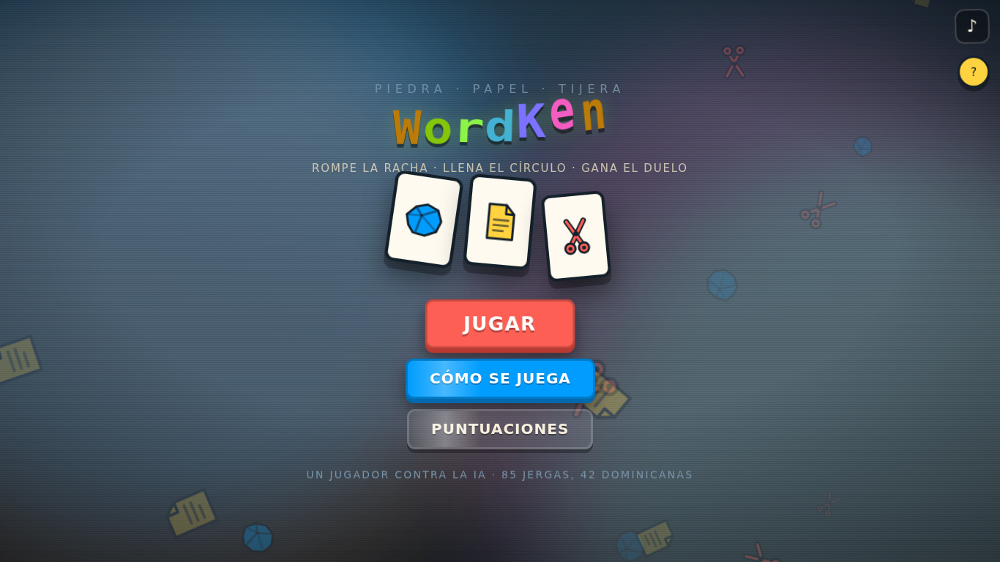 | 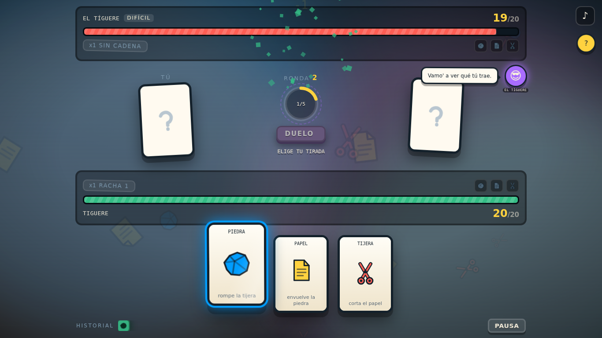 |

| Duelo de palabras | Elección de bonificación |
|---|---|
| 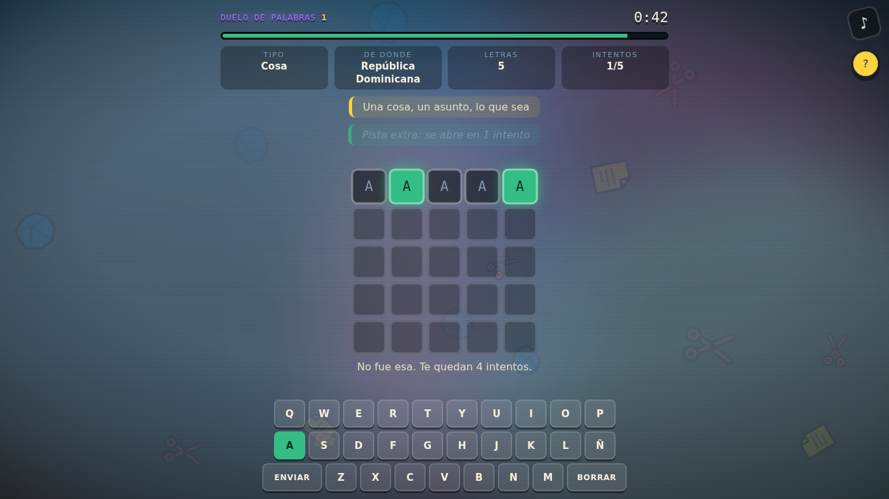 | 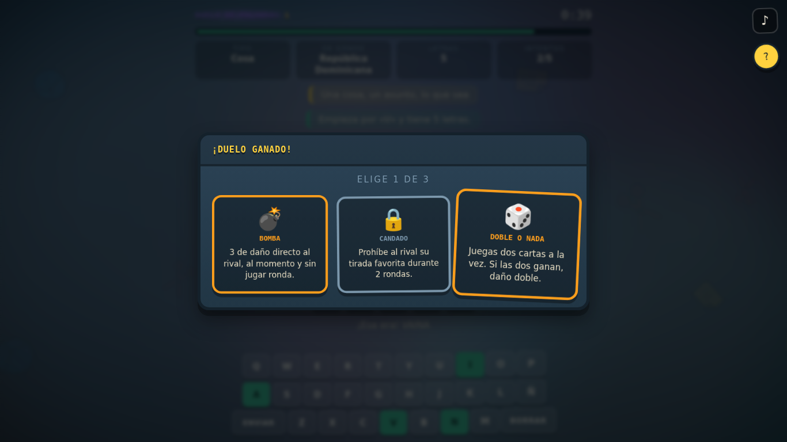 |

| Configuración | Móvil |
|---|---|
| 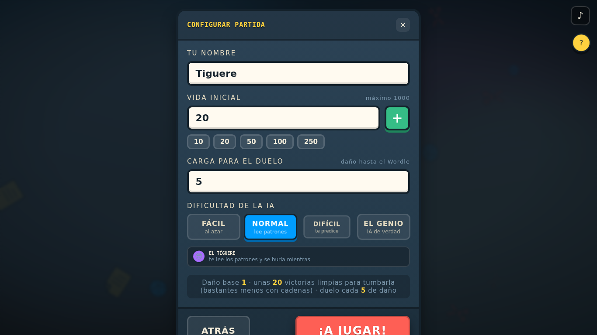 | 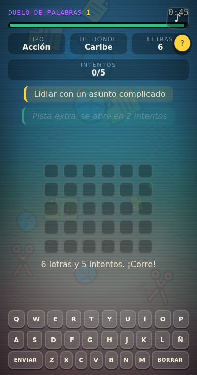 |

La pistola de la IA activa y el escudo en la mano del jugador:

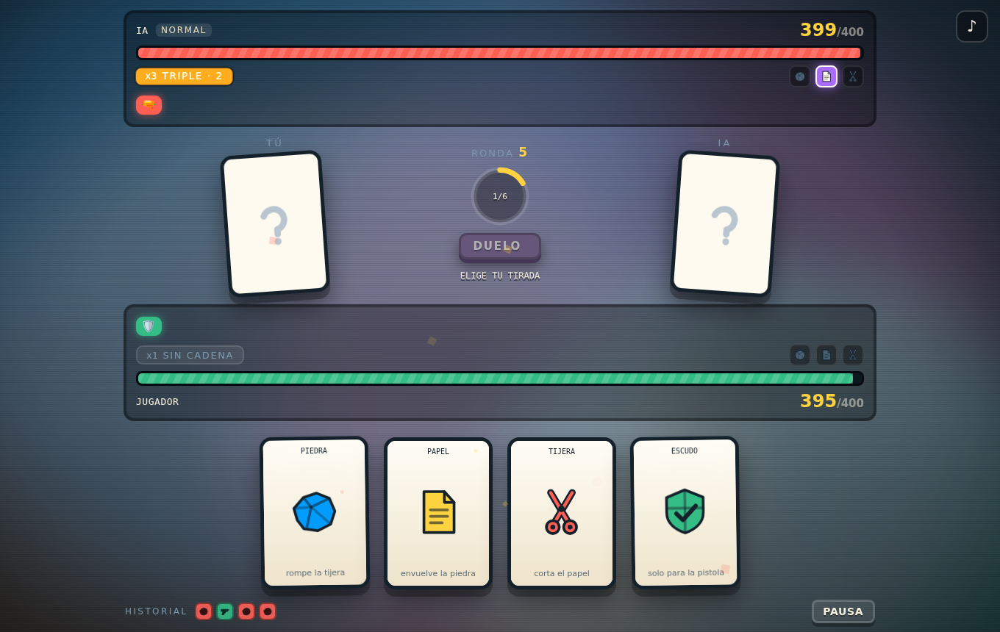

Las cartas se levantan, se inclinan en 3D y se iluminan de su propio color:

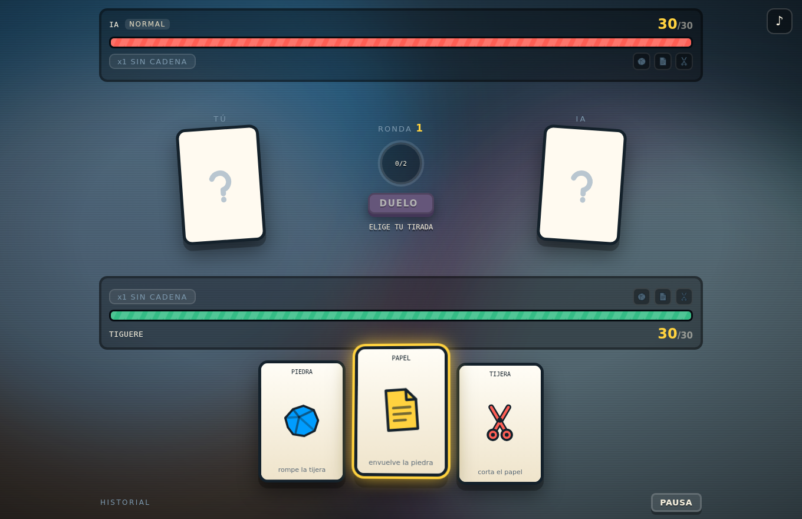

El duelo con las cuatro casillas de datos y las dos pistas:

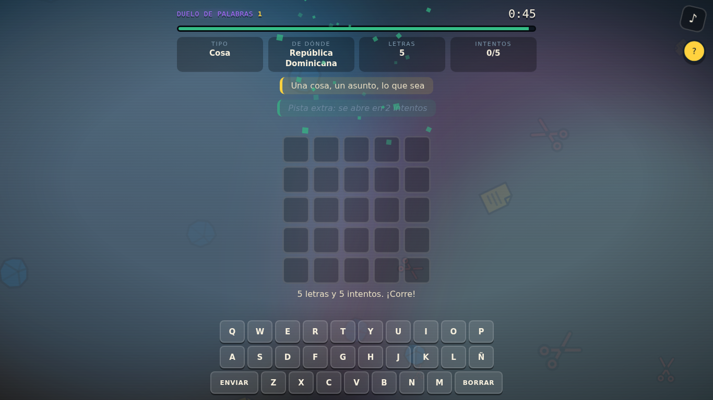

Cada habilidad especial entra con su propia animación a pantalla completa:

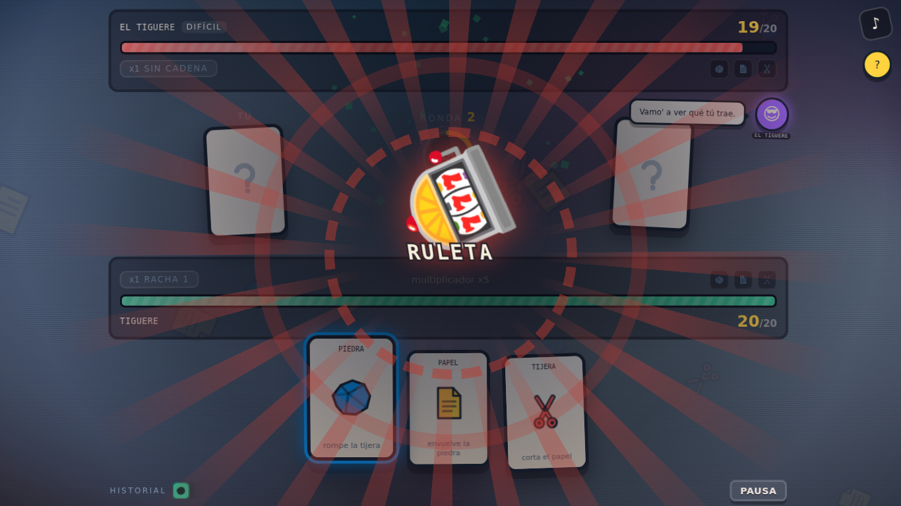

El ayudante, que explica cómo se juega sin salir del juego:

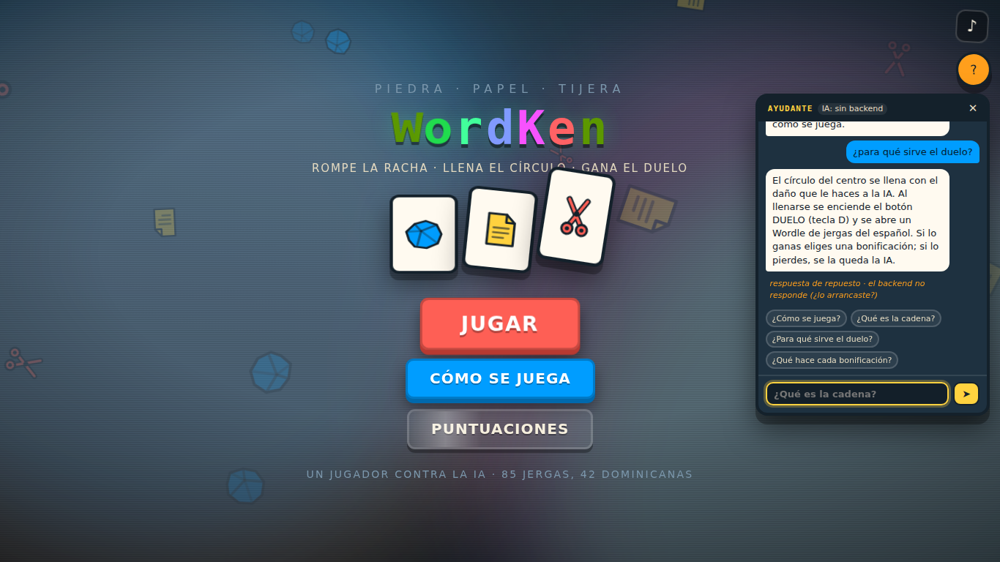

Al elegir dificultad se ve con quién te vas a encontrar:

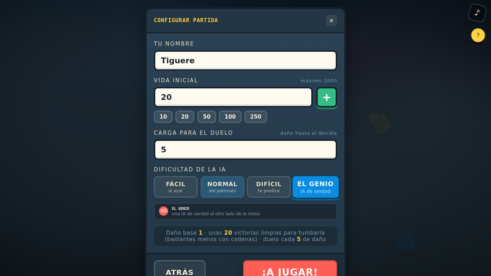

**Impactos: el martillo cae sobre la barra del rival y la pistola rebota en su escudo**

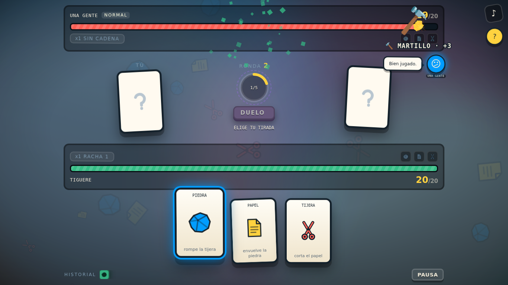
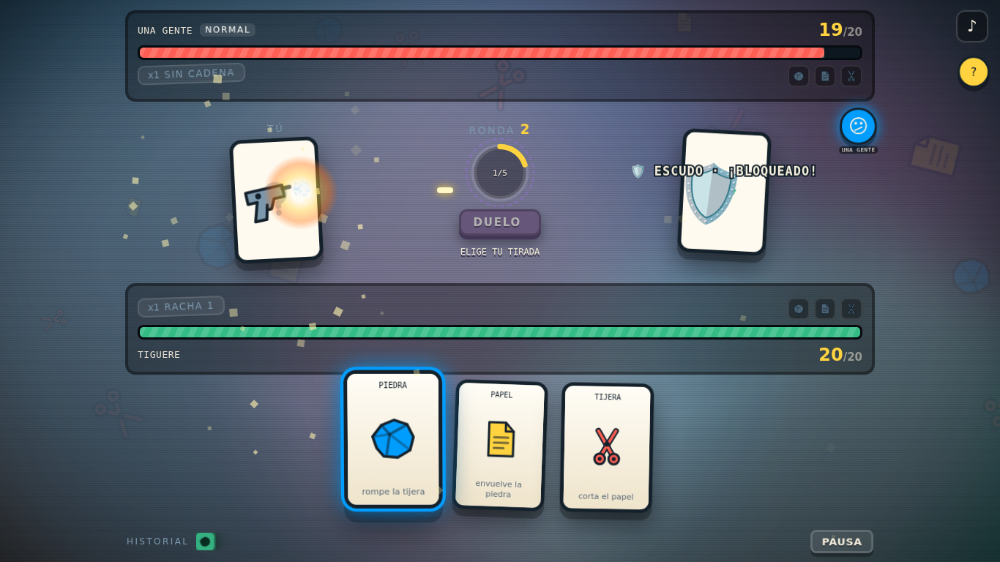

**El jackpot de la cadena máxima, en el golpe del MEGA JACKPOT**

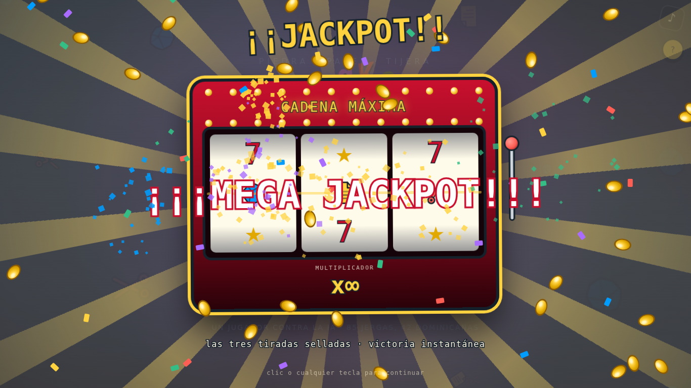

---

## 4. Descargarlo de GitHub y jugar

```bash
git clone <url-del-repositorio>
cd mini-proyecto-ra1
```

Y después, según el sistema:

- **Windows:** doble clic en `jugar.bat`.
- **macOS / Linux:** `bash jugar.sh` en una terminal.
- **Cualquiera:** `npm start` desde la carpeta del proyecto.

La primera vez instala solo las dependencias del backend (unos segundos, hace
falta internet) y crea `backend/.env` a partir de `backend/.env.example`. Luego
abre el navegador en `http://localhost:5500`. Si tu Node es demasiado viejo, el
lanzador lo dice y explica qué instalar, en vez de fallar con un error raro.

Lo que **no** está en el repositorio, a propósito: `node_modules/` (se instala),
`backend/.env` (tus claves; se crea desde el ejemplo) y `backend/datos/` (la base
de datos; se crea sola). Ver `.gitignore`.

---

## 4.1 Requisitos previos

- **Node.js 22.13 o superior** — lo recomendable es la versión **LTS** que ofrezca
  [nodejs.org](https://nodejs.org) (probado con 22 y 24). Comprobar con `node --version`.
- **npm** (viene con Node).
- **Nada más.** No hace falta Visual Studio, Python ni herramientas de compilación:
  la base de datos usa el SQLite que ya trae Node dentro (`node:sqlite`) y las tres
  dependencias del backend (`express`, `cors`, `dotenv`) son JavaScript puro.
- Un navegador moderno.
- Para el frontend, un **servidor estático**. El proyecto usa módulos ES6
  (`import` / `export`) y **no funciona abriendo `index.html` con doble clic**:
  el navegador bloquea los módulos servidos por `file://`. La extensión
  **Live Server** de VS Code sirve.

---

## 5. Cómo abrirlo

### 5.0 La forma fácil (recomendada)

**Windows:** doble clic en **`jugar.bat`**.
**macOS y Linux:** `./jugar.sh` (o `bash jugar.sh`).
**Cualquier sistema, desde la terminal:** `npm start` en la raíz del proyecto.

Eso hace todo solo: instala las dependencias la primera vez, crea el `.env`,
levanta el backend, sirve el frontend en `http://localhost:5500` y abre el
navegador. Para cerrarlo todo, `Ctrl+C` en esa ventana.

El servidor del frontend (`herramientas/servidor-estatico.mjs`) está escrito
con lo que trae Node de fábrica, sin ninguna dependencia: así no hace falta
instalar la extensión Live Server ni descargar nada el día de la presentación.

> **No sirve abrir `index.html` con doble clic.** El proyecto usa módulos ES6 y
> el navegador los bloquea en `file://`. Por eso hace falta un servidor, y por
> eso existe el lanzador.

### 5.1 Backend (a mano)

```bash
cd backend
npm install
cp .env.example .env      # en Windows: copy .env.example .env
```

Abre `.env` y cambia `CLAVE_API` por un valor propio. Después:

```bash
npm run semilla           # opcional: mete 3 partidas de ejemplo
npm start
```

El servidor queda escuchando en `http://localhost:3000/api`. La base de datos
SQLite se crea sola en `backend/datos/juego.db` la primera vez, arranques desde
donde arranques: la ruta se toma siempre relativa a la carpeta `backend/`.

#### Conectar un modelo de lenguaje (opcional)

Es lo que enciende la dificultad **EL GENIO** y el cerebro bueno del ayudante.
**Sin esto el juego funciona igual**, solo que con las respuestas de repuesto.

En `backend/.env`:

```bash
IA_URL_BASE=https://api.groq.com/openai/v1    # o el proveedor que sea
IA_CLAVE=tu-clave-aqui
IA_MODELO=el-modelo-que-ofrezca-tu-cuenta
```

Vale cualquier proveedor con formato OpenAI, que son casi todos: OpenAI, Groq,
OpenRouter, Together, la ruta compatible de Gemini o un **Ollama** en tu propio
portátil, que no cuesta nada ni tiene cupo. En `.env.example` están las URL de
cada uno.

**Con Ollama** (gratis, sin cuenta): instálalo desde [ollama.com](https://ollama.com),
descarga el modelo con `ollama pull llama3.2` y pon en `backend/.env`:

```bash
IA_URL_BASE=http://localhost:11434/v1   # termina en /v1, no en /api
IA_CLAVE=ollama                         # cualquier texto: vacía significa "sin IA"
IA_MODELO=llama3.2
IA_TIEMPO_LIMITE_MS=20000               # la primera respuesta carga el modelo y tarda
```

Para comprobar que responde, con el backend arrancado abre
`http://localhost:3000/api/mente/prueba`: debe salir `"funciona":true`.

Cada persona que clone el repositorio tiene que hacer esto en **su** equipo: el
modelo no viaja con el código. Para que otros usen el Ollama de un solo PC se
puede publicar su puerto con un túnel (`ngrok http 11434
--host-header="localhost:11434"`) y poner la dirección del túnel, seguida de
`/v1`, en `IA_URL_BASE`; ese PC tiene que estar encendido mientras se juega.

> ⚠️ **La clave va en `backend/.env` y solo ahí.** El enunciado lo prohíbe
> expresamente en el código fuente, y además sería inútil ponerla en el
> frontend: cualquiera abre el JavaScript de una página con F12. El navegador
> le habla a `/api/mente` y es el servidor quien llama al proveedor.
> `.env` está en `.gitignore`; `.env.example` sí se sube, con la clave vacía.

### 5.2 Frontend (a mano)

Con el backend en marcha, sirve la carpeta `frontend/`:

```bash
# opción A — el servidor del propio proyecto, sin dependencias
npm run frontend
# opción B — Live Server de VS Code (hay que instalar la extensión)
# opción C — con Python
cd frontend && python -m http.server 5500
```

Y abre la dirección que te dé (por ejemplo `http://localhost:5500`).

> **Si el navegador se queja de CORS**, el origen desde el que estás sirviendo el
> frontend no está en `ORIGENES_PERMITIDOS` del `.env`. El mensaje de error dice
> exactamente qué origen es: añádelo a la lista y reinicia el backend.

> **El juego funciona sin el backend.** Si el servidor no está levantado,
> simplemente no se guardan las partidas ni se ve la tabla de puntuaciones; la
> partida se juega igual.

### 5.3 Verificar las normas del enunciado

```bash
node herramientas/verificar-normas.mjs
```

Comprueba automáticamente lo que el enunciado exige en su sección 4: archivos de
menos de 300 líneas, funciones de menos de 40, como mucho 3 niveles de
anidación, cero `console.log`, nada de `onclick` ni `style=` en el HTML y
nombres en kebab-case.

---

## 6. Estructura del proyecto

```
mini-proyecto-ra1/
├── frontend/
│   ├── index.html
│   └── src/
│       ├── css/          14 hojas, una por zona de la interfaz
│       ├── js/
│       │   ├── main.js       punto de entrada: solo orquesta
│       │   ├── core/         bus de eventos, reloj, escenas, bucle de animación
│       │   ├── entities/     una clase por entidad del juego
│       │   ├── scenes/       menú, partida, duelo, pausa, fin
│       │   ├── input/        teclado y puntero, aislados
│       │   ├── render/       todo lo que toca el DOM
│       │   ├── modules/      las reglas del juego (sin DOM)
│       │   ├── services/     comunicación con el backend
│       │   └── utils/        ayudas reutilizables
│       └── assets/       audios e iconos
├── backend/
│   ├── server.js         solo levanta el servidor
│   └── src/
│       ├── config/       entorno, base de datos, app de Express
│       ├── routes/       qué verbo va con qué controlador
│       ├── controllers/  reciben la petición y responden
│       ├── services/     reglas de negocio
│       ├── repositories/ el único sitio con SQL
│       ├── models/       esquema y traducción BD ↔ API
│       ├── middlewares/  validación, autorización y errores
│       └── utils/        respuestas y errores HTTP
├── docs/                 relevo, documento técnico, autoevaluación, guion de defensa
├── herramientas/         lanzador, servidor estático y verificador de normas
├── jugar.bat             lanzador de Windows (doble clic)
└── jugar.sh              lanzador de macOS y Linux
```

La regla que sostiene el frontend: **`modules/` y `entities/` no tocan el DOM**.
El motor de la ronda devuelve un *parte* de lo que ha pasado y `scenes/` lo
escenifica. Por eso la partida entera se puede probar desde la consola sin que
haya una sola carta en pantalla.

---

## 7. La API

Formato de respuesta único: `{ success, data, message }`.

| Verbo | Ruta | Qué hace | Códigos |
|---|---|---|---|
| GET | `/api/jugadores` | Lista de jugadores | 200 |
| GET | `/api/jugadores/:id` | Un jugador | 200, 400, 404 |
| POST | `/api/jugadores` | Crea un jugador | 201, 400 |
| PUT | `/api/jugadores/:id` | Renombra un jugador | 200, 400, 401, 404 |
| DELETE | `/api/jugadores/:id` | Borra jugador y sus partidas | 200, 400, 401, 404 |
| GET | `/api/partidas` | Últimas partidas (`?jugadorId=`, `?limite=`) | 200, 404 |
| GET | `/api/partidas/:id` | Una partida | 200, 400, 404 |
| POST | `/api/partidas` | Registra una partida terminada | 201, 400 |
| DELETE | `/api/partidas/:id` | Borra una partida | 200, 400, 401, 404 |
| GET | `/api/puntuaciones` | Tabla de puntuaciones (`?limite=`) | 200 |
| GET | `/api/mente` | ¿Hay modelo de lenguaje configurado? | 200 |
| POST | `/api/mente/jugada` | Tirada y comentario de EL GENIO | 200 |
| POST | `/api/mente/ayuda` | Respuesta del chatbot de ayuda | 200, 400 |
| GET | `/api/mente/prueba` | Consulta real al modelo: tarda, responde y, si falla, **por qué** | 200 |

`PUT` y `DELETE` exigen la cabecera `x-clave-api` con el valor de `CLAVE_API`
del `.env`; sin ella devuelven **401**.

Las rutas de `/api/mente` **nunca devuelven error por no haber modelo**:
contestan `disponible: false` con un 200, porque que no haya clave no es un
fallo, es el caso normal. Tampoco guardan nada en la base de datos: son un
intermediario hacia el proveedor, y existen para que la clave no salga del
servidor.

**Al jugador se le habla normal.** Si el modelo falla, el ayudante contesta con
su tabla de respuestas sin dar explicaciones técnicas, y la cabecera del chat
solo dice `en línea` cuando hay un modelo contestando.

**Si el ayudante contesta con frases de repuesto y quieres saber por qué**, abre
el juego en **modo diagnóstico**, añadiendo `?diagnostico` a la dirección
(`http://127.0.0.1:5500/?diagnostico`). Entonces el juego dice el motivo en la
cabecera del chat (`IA: llama3.2` en verde, o `IA: sin backend` / `IA: apagada`)
y en una nota naranja debajo de cada respuesta de repuesto; las frases de EL
GENIO escritas por el modelo llevan un sello rojo **IA**, y la tabla de
puntuaciones y el fin de partida explican cómo levantar el servidor. Sin
`?diagnostico` nada de eso se ve. Además, siempre, la terminal del backend
apunta los fallos (`[modelo] el modelo tardó más de 12000 ms…`, `[modelo] el
proveedor respondió 404 · ¿existe el modelo…?`), y abriendo
**http://localhost:3000/api/mente/prueba** en el navegador se le hace al modelo
la misma consulta que haría el chat y se ve cuánto tarda.

**La puntuación la calcula el servidor**, no el navegador. El cliente manda
hechos (rondas, daño, duelos ganados) y el backend deduce el número. Si la
mandara el cliente, cualquiera podría escribir 999999 desde la consola.

---

## 8. Trampas conocidas del entorno

1. **OneDrive.** Si el proyecto vive en OneDrive y los `.mp3` aparecen con el
   icono de nube (no descargados), el navegador se queda esperando y la música
   no suena. Solución: clic derecho en la carpeta → *Conservar siempre en este
   dispositivo*.
2. **Brave** bloquea el autoplay más que Chrome. No es un fallo del juego: el
   audio arranca en el primer clic o tecla, y si el navegador lo corta el gestor
   de audio lo reintenta solo en el siguiente gesto.
3. **`file://` no vale.** Los módulos ES6 necesitan un servidor.
4. Los audios ocupan unos 84 MB. GitHub los admite (ningún archivo pasa de
   100 MB), pero el clonado tarda. Si molesta, se pueden mover a Git LFS.

---

## 9. Despliegue

- **Frontend** → Netlify o Vercel, publicando la carpeta `frontend/`.
  Antes hay que poner la URL pública del backend en
  `frontend/src/js/services/configuracion-api.js`.
- **Backend** → Render o Railway, con las variables del `.env` cargadas como
  variables de entorno del servicio. Con SQLite hace falta montar un disco
  persistente; si no, la base de datos se borra en cada despliegue.
